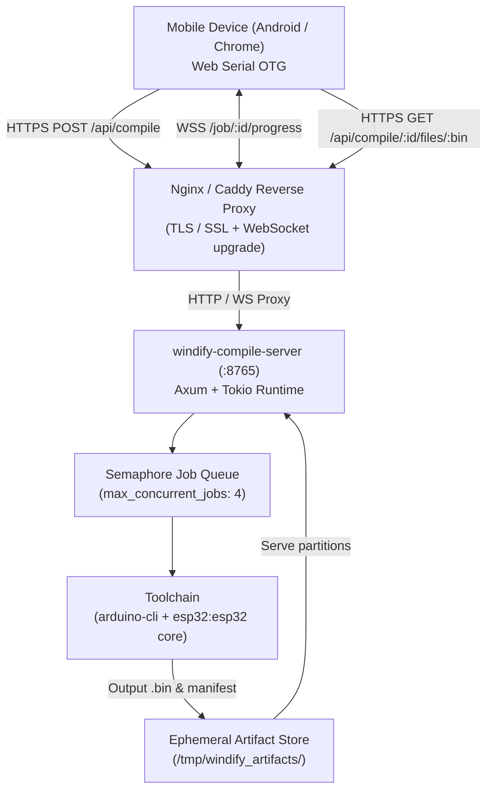

# Windify Compile Server Deployment Guide

> Production deployment manual for `windify-compile-server`: the remote Arduino/ESP32-S3 cloud compiler enabling mobile browser OTG flashing.

---

## 1. Architecture Overview



---

## 2. Server Requirements

| Component | Minimum | Recommended | Notes |
|---|---|---|---|
| **CPU** | 2 cores | 4+ cores | Compilation is CPU-bound during C++ AST building |
| **RAM** | 2 GB | 4 GB+ | ESP32-S3 compiler peak memory ~800MB per concurrent job |
| **Disk** | 10 GB SSD | 25 GB SSD | Toolchain core takes ~2.5 GB; workspaces are cleaned up |
| **OS** | Ubuntu 22.04 / 24.04 LTS | Debian 12 / Ubuntu 24.04 | Standard Linux distro |
| **Network** | 10 Mbps | 100 Mbps+ | Binaries are ~1–3 MB per compilation |

---

## 3. Option A: Docker Deployment (Recommended)

Docker provides complete isolation of the `arduino-cli` environment and prevents host package contamination.

### Step 1: Clone Repository
```bash
git clone https://github.com/windify-vn/scratch-devices-link-lib.git
cd scratch-devices-link-lib/compile-server
```

### Step 2: Configure Environment
Create `.env` file (or edit `docker-compose.yml`):
```env
COMPILE_SERVER_PORT=8765
COMPILE_SERVER_HOST=0.0.0.0
MAX_CONCURRENT_JOBS=4
JOB_TIMEOUT_SECS=180
JOB_RETAIN_SECS=600
CORS_ORIGINS=*
```

### Step 3: Launch with Docker Compose
```bash
docker compose up -d --build
```

### Step 4: Verify Deployment
```bash
curl http://localhost:8765/status
```
Expected output:
```json
{
  "server": "windify-compile-server",
  "version": "0.1.0",
  "ready": true,
  "arduinoCli": {
    "path": "/usr/local/bin/arduino-cli",
    "found": true
  },
  "maxConcurrentJobs": 4,
  "jobTimeoutSecs": 180
}
```

---

## 4. Option B: Bare-Metal / VPS Systemd Deployment

### Step 1: Install Dependencies
```bash
sudo apt update && sudo apt install -y curl ca-certificates python3 python3-pip python3-serial build-essential
```

### Step 2: Install `arduino-cli` & ESP32 Board Core
```bash
# Install arduino-cli binary
curl -fsSL https://raw.githubusercontent.com/arduino/arduino-cli/master/install.sh | sudo BINDIR=/usr/local/bin sh

# Configure board manager URLs
arduino-cli config init
arduino-cli config add board_manager.additional_urls https://espressif.github.io/arduino-esp32/package_esp32_index.json

# Update core index and install ESP32 platform
arduino-cli core update-index
arduino-cli core install esp32:esp32
```

### Step 3: Build the Binary
```bash
cd compile-server
cargo build --release
sudo cp target/release/windify-compile-server /usr/local/bin/
```

### Step 4: Create Systemd Service
Create `/etc/systemd/system/windify-compile-server.service`:
```ini
[Unit]
Description=Windify Remote Compile Server
After=network.target

[Service]
Type=simple
User=www-data
Group=www-data
WorkingDirectory=/var/lib/windify-compile-server
ExecStart=/usr/local/bin/windify-compile-server
Restart=always
RestartSec=5s

# Environment settings
Environment=COMPILE_SERVER_PORT=8765
Environment=COMPILE_SERVER_HOST=127.0.0.1
Environment=ARDUINO_CLI_PATH=/usr/local/bin/arduino-cli
Environment=MAX_CONCURRENT_JOBS=4
Environment=JOB_TIMEOUT_SECS=180
Environment=JOB_RETAIN_SECS=600
Environment=CORS_ORIGINS=*

# Security hardening
ProtectSystem=full
ProtectHome=true
NoNewPrivileges=true
PrivateTmp=true

[Install]
WantedBy=multi-user.target
```

Enable and start the service:
```bash
sudo mkdir -p /var/lib/windify-compile-server
sudo chown www-data:www-data /var/lib/windify-compile-server
sudo systemctl daemon-reload
sudo systemctl enable --now windify-compile-server
```

---

## 5. Reverse Proxy Configuration

A reverse proxy is **mandatory** for production because browsers require `HTTPS` and `WSS` to use Web Serial and fetch remote APIs securely.

### Scenario A: Same VPS — GUI & Compile Server Co-hosting (Single Port 80 / 443)

When both the **Web Editor GUI** (`windify-scratch-editor`) and the **Compile Server** (`windify-compile-server`) are hosted on the **same VPS**, you do **NOT** need to expose port 8765 to the internet.

Nginx serves the GUI from port 80/443 and internally routes `/api/compile` and `/job/` to `http://127.0.0.1:8765`.

#### Benefits:
- **No Extra Ports**: Only port 80 (and 443) need to be open in firewall / cloud security groups.
- **Zero CORS Issues**: The frontend and compile API share the exact same origin.
- **No Mixed Content Warnings**: Both WebSocket (`wss://`) and API (`https://`) share the same SSL certificate.
- **Automatic Frontend Discovery**: No manual URL configuration is needed; `CompileClient` automatically defaults to `window.location.origin`.

#### Nginx Configuration (`/etc/nginx/sites-available/windify.conf`)
```nginx
server {
    listen 80;
    server_name your-domain.com; # or your VPS IP address

    # Optional: Redirect HTTP to HTTPS
    # return 301 https://$host$request_uri;

    # Maximum payload size for sketches with embedded audio clips
    client_max_body_size 50M;

    # 1. Frontend Web Editor GUI static files
    location / {
        root /var/www/windify-scratch-editor/build;
        index index.html;
        try_files $uri $uri/ /index.html;
    }

    # 2. Proxy compile REST endpoints to local compile-server
    location /api/compile {
        proxy_pass http://127.0.0.1:8765;
        proxy_set_header Host $host;
        proxy_set_header X-Real-IP $remote_addr;
        proxy_set_header X-Forwarded-For $proxy_add_x_forwarded_for;
        proxy_set_header X-Forwarded-Proto $scheme;
        
        proxy_buffering off;
        proxy_read_timeout 300s;
    }

    # 3. Proxy WebSocket compilation progress stream
    location ~ ^/job/.+/progress$ {
        proxy_pass http://127.0.0.1:8765;
        proxy_http_version 1.1;
        proxy_set_header Upgrade $http_upgrade;
        proxy_set_header Connection "upgrade";
        proxy_set_header Host $host;
        proxy_set_header X-Real-IP $remote_addr;
        proxy_read_timeout 3600s;
        proxy_send_timeout 3600s;
    }
}
```

---

### Scenario B: Dedicated Subdomain (`compile.windify.vn`)
When the compile server runs on a dedicated domain or separate server:

```nginx
server {
    listen 80;
    server_name compile.windify.vn;
    return 301 https://$host$request_uri;
}

server {
    listen 443 ssl http2;
    server_name compile.windify.vn;

    ssl_certificate /etc/letsencrypt/live/compile.windify.vn/fullchain.pem;
    ssl_certificate_key /etc/letsencrypt/live/compile.windify.vn/privkey.pem;

    # Client body limit for large sketch uploads with audio clips
    client_max_body_size 50M;

    # Proxy root & REST endpoints
    location / {
        proxy_pass http://127.0.0.1:8765;
        proxy_set_header Host $host;
        proxy_set_header X-Real-IP $remote_addr;
        proxy_set_header X-Forwarded-For $proxy_add_x_forwarded_for;
        proxy_set_header X-Forwarded-Proto $scheme;
        
        # Buffer tweaks for large payloads
        proxy_buffering off;
        proxy_read_timeout 300s;
    }

    # WebSocket progress stream (requires Upgrade headers)
    location ~ ^/job/.+/progress$ {
        proxy_pass http://127.0.0.1:8765;
        proxy_http_version 1.1;
        proxy_set_header Upgrade $http_upgrade;
        proxy_set_header Connection "upgrade";
        proxy_set_header Host $host;
        proxy_set_header X-Real-IP $remote_addr;
        proxy_read_timeout 3600s;
        proxy_send_timeout 3600s;
    }
}
```

### Caddyfile Alternative (Same VPS)
```caddy
your-domain.com {
    # 1. Reverse proxy compile API & WS progress to local compile-server
    handle /api/compile* {
        reverse_proxy 127.0.0.1:8765
    }
    handle /job/* {
        reverse_proxy 127.0.0.1:8765
    }

    # 2. Serve GUI static files for everything else
    handle {
        root * /var/www/windify-scratch-editor/build
        file_server
        try_files {path} /index.html
    }
}
```

---

## 6. Frontend Client Configuration

In `windify-scratch-editor`, the frontend automatically discovers the compile server URL via the following precedence:

1. **Global Variable**:
   Set in `window.WINDIFY_COMPILE_SERVER_URL` in `index.html`:
   ```html
   <script>
     window.WINDIFY_COMPILE_SERVER_URL = "https://compile.windify.vn";
   </script>
   ```
2. **LocalStorage Override**:
   Can be set by user or settings UI in the browser console:
   ```javascript
   localStorage.setItem('windify_compile_server_url', 'https://compile.windify.vn');
   ```
3. **Same-host Default (Zero Configuration)**:
   If unconfigured, `CompileClient` defaults directly to `window.location.origin` (port 80 or 443). When hosted on the same VPS, Nginx proxies requests internally to port 8765 without needing any extra configuration.

---

## 7. Configuration Reference

| Environment Variable | Default | Description |
|---|---|---|
| `COMPILE_SERVER_HOST` | `0.0.0.0` | Bind IP address (`127.0.0.1` behind reverse proxy). |
| `COMPILE_SERVER_PORT` | `8765` | TCP port to listen on. |
| `ARDUINO_CLI_PATH` | `arduino-cli` | Path to the `arduino-cli` executable. |
| `ARDUINO_CONFIG_FILE` | *None* | Optional custom `arduino-cli.yaml` configuration. |
| `EXTRA_LIBRARY_PATH` | *None* | Colon/semicolon-separated extra library paths to inject into `--libraries`. |
| `MAX_CONCURRENT_JOBS` | `4` | Maximum parallel compilation processes. Additional jobs queue in order. |
| `JOB_TIMEOUT_SECS` | `180` | Hard timeout per compilation in seconds before returning error. |
| `JOB_RETAIN_SECS` | `600` | Retention duration for finished binary artifacts before disk cleanup. |
| `CORS_ORIGINS` | `*` | Allowed CORS origins (comma-separated domains or `*`). |

---

## 8. Troubleshooting & Operations

### 1. "arduino-cli not found"
- Run `which arduino-cli` and verify the executable is in `/usr/local/bin` or set `ARDUINO_CLI_PATH=/path/to/arduino-cli`.
- Check permissions: `sudo chmod +x /usr/local/bin/arduino-cli`.

### 2. "Platform esp32:esp32 not found"
- Ensure ESP32 core is installed for the user running the server:
  ```bash
  arduino-cli core list
  ```
  If missing:
  ```bash
  arduino-cli core install esp32:esp32
  ```

### 3. High Memory Usage During Concurrent Compiles
- If running on a 2GB VPS, reduce `MAX_CONCURRENT_JOBS=2`.
- Enable swap memory:
  ```bash
  sudo fallocate -l 4G /swapfile
  sudo chmod 600 /swapfile
  sudo mkswap /swapfile
  sudo swapon /swapfile
  ```

### 4. WebSocket Disconnections
- Ensure your Nginx configuration includes:
  ```nginx
  proxy_set_header Upgrade $http_upgrade;
  proxy_set_header Connection "upgrade";
  proxy_read_timeout 3600s;
  ```
