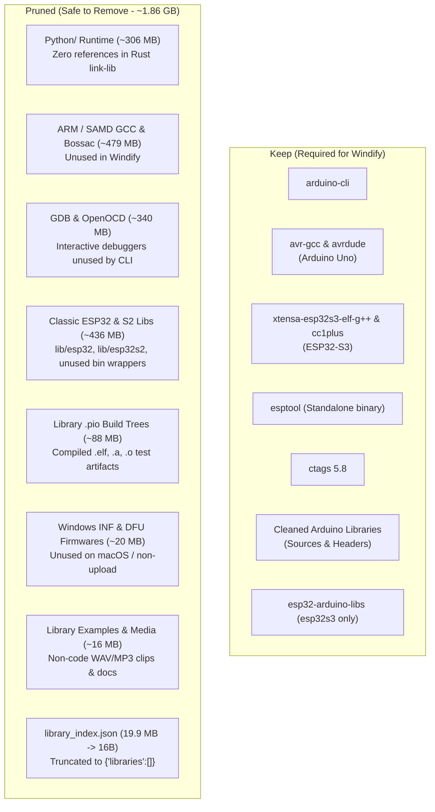

# Toolchain Optimization & Compression: Plan & Results

> Comprehensive strategy, architectural rationale, and verified results for slimming down the local toolchain package (`tools-mac` / `tools`) from **~2.81 GB** down to **~948 MB** while preserving 100% build and upload compatibility for Windify microcontrollers.

---

## 1. System Context & Motivation

Windify Scratch Editor compiles sketches in the browser and sends them to the local desktop daemon ([`scratch-devices-link-lib`](file:///c:/Code/scratch-devices-link-lib)). The link daemon delegates compilation and flashing to local CLI tools under `tools/Arduino/`.

### Supported Hardware Boards
Windify exclusively targets two board configurations:
1. **Kit V1 (Arduino Uno)**: FQBN `arduino:avr:uno`  
   - Requires: `avr-gcc`, `avrdude`, and the `arduino:avr` core.
2. **Windify Kit V2 / Dev Kit (ESP32-S3)**: FQBN `esp32:esp32:esp32s3:...`  
   - Requires: `arduino-cli`, `xtensa-esp32s3-elf-g++`, `cc1plus`, `esptool`, `ctags`, and the `esp32s3` IDF core libraries.

Legacy tool bundles (originating from OpenBlock) contained multi-board toolchains (RP2040, K210, ESP8266, SAMD, ARM, Renesas Uno), an embedded Python 3.11 environment, interactive JTAG debuggers, and test build artifacts. This bloated the distribution package to **~2.81 GB (30,569 files)**.

---

## 2. Slimming Plan & Architectural Rationale

Every component removed was cross-checked against the upload workflow documented in [`upload-workflow.md`](./upload-workflow.md) and the strict validator in [`shell/src/toolchain.rs`](../shell/src/toolchain.rs):



### Detailed Component Analysis

| Category | Targets / Locations | Size | Reason Safe to Remove |
|---|---|---|---|
| **ARM Toolchain** | `Arduino/packages/arduino/tools/arm-none-eabi-gcc`<br/>`Arduino/packages/arduino/tools/{bossac,dfu-util,openocd,arduinoOTA}` | **478.67 MB** | Legacy SAMD / Zero / Nano 33 IoT boards; Windify does not support ARM targets. |
| **Non-S3 ESP32 Libs & Binaries** | `esp32/tools/esp-x32/2405/xtensa-esp-elf/lib/{esp32,esp32s2}`<br/>`esp32/tools/esp-x32/2405/lib/gcc/xtensa-esp-elf/13.2.0/{esp32,esp32s2}`<br/>`esp32/tools/esp-x32/2405/lib/{xtensa_esp32.so,xtensa_esp32s2.so,xtensa_esp8266.so}`<br/>`esp32/tools/esp-x32/2405/bin/{xtensa-esp32-elf-*,xtensa-esp32s2-elf-*}` | **435.70 MB** | Classic ESP32, ESP32-S2, and ESP8266 precompiled libraries and wrapper binaries. Windify only compiles for ESP32-S3. |
| **GDB & OpenOCD** | `esp32/tools/xtensa-esp-elf-gdb`<br/>`esp32/tools/riscv32-esp-elf-gdb`<br/>`esp32/tools/openocd-esp32` | **340.14 MB** | Interactive JTAG debuggers. `arduino-cli compile` and `upload` only generate binaries and flash over serial. |
| **Python Runtime** | `Python/` (entire folder) | **305.62 MB** | Legacy OpenBlock tool bundle included Python for `esptool.py`. Windify uses the standalone compiled `esptool` binary; the Rust link daemon has zero Python calls. |
| **Library Build Artifacts** | `Arduino/libraries/*/{.pio,.git,.github,.vscode}`<br/>(e.g., `ESP_Scan/.pio`, `WS2812B/.pio`, `Motor/.pio`) | **87.80 MB** | PlatformIO test project leftovers containing compiled `.elf`, `.map`, `.a`, and `.o` files. |
| **Index Catalogs** | `Arduino/library_index.json` (truncated to `{"libraries":[]}`)<br/>`Arduino/package_{rp2040,esp8266com,sparkfun,Maixduino_*}_index.json` | **21.11 MB** | Online package manager metadata. Truncating `library_index.json` prevents `arduino-cli` from downloading a 54 MB index. |
| **AVR Drivers & Firmwares** | `Arduino/packages/arduino/hardware/avr/1.8.6/{drivers,firmwares}` | **19.94 MB** | Windows `.inf`, `.cat`, `dpinst-amd64.exe` files (irrelevant on macOS) and ATmega16U2 DFU hex files. |
| **Library Examples & Docs** | `Arduino/libraries/*/{examples,example,tests,extras,doc,docs}` | **16.12 MB** | Sample audio files (e.g. `ESP8266Audio/examples` contains 11.28 MB of WAV/MP3 clips) and HTML docs. Arduino CLI only compiles `src/` or root headers. |
| **Unused Discoveries & Temp** | `Arduino/packages/builtin/tools/{mdns-discovery,serial-monitor,dfu-discovery}`<br/>`Arduino/packages/builtin/tools/serial-discovery/{1.2.1,1.3.2}`<br/>Residual `.DS_Store` and `Arduino/.vscode` | **28.68 MB** | Link daemon manages serial ports via its own native Rust `serialport` stack; older discovery tool versions and OS metadata are unnecessary. |

---

## 3. Results (Before vs After)

Execution was performed using [`shell/scripts/prune-tools.ps1`](../shell/scripts/prune-tools.ps1) with `-Apply`:

| Metric | Before Pruning | After Pruning | Savings |
|---|---|---|---|
| **Total Disk Size** | **2,807.61 MB (~2.81 GB)** | **948.45 MB (~0.93 GB)** | **-1,859.16 MB (-64.6%)** |
| **Total File Count** | **30,569 files** | **10,569 files** | **-20,000 files (-65.4%)** |
| **`library_index.json`** | 19,933,526 bytes (~19.9 MB) | 16 bytes (`{"libraries":[]}`) | -19.93 MB |
| **Cleaned Libraries** | 30 libraries with `.pio` bloat | 30 clean libraries | 100% source headers & `.cpp` preserved |
| **Distribution Archive (`.7z`)** | ~358 MB | **~130–150 MB** (estimated) | **>60% download savings** |

---

## 4. Toolchain Invariants & Verification

To guarantee zero regression in sketch compilation and flashing, the pruned toolchain was validated against [`shell/src/toolchain.rs`](../shell/src/toolchain.rs) (`validate_toolchain`):

```powershell
arduino-cli            : True (Arduino/arduino-cli)
platform.txt           : True (Arduino/packages/esp32/hardware/esp32/3.1.3/platform.txt)
esptool                : True (Arduino/packages/esp32/tools/esptool_py/4.9.dev3/esptool)
xtensa-esp32s3-elf-g++ : True (Arduino/packages/esp32/tools/esp-x32/2405/bin/xtensa-esp32s3-elf-g++)
cc1plus                : True (Arduino/packages/esp32/tools/esp-x32/2405/libexec/gcc/xtensa-esp-elf/13.2.0/cc1plus)
ctags                  : True (Arduino/packages/builtin/tools/ctags/5.8-arduino11/ctags)
libraries_dir          : True (Arduino/libraries)
avr-g++ (Uno)          : True (Arduino/packages/arduino/tools/avr-gcc/7.3.0-atmel3.6.1-arduino7/bin/avr-g++)
avrdude (Uno)          : True (Arduino/packages/arduino/tools/avrdude/6.3.0-arduino17/bin/avrdude)
```

All 30 Arduino libraries retain 100% of their header and C++ implementation files.

---

## 5. Maintenance & Script Usage

Pruning scripts are maintained in `shell/scripts/` for both Windows PowerShell and macOS/Linux Bash.

### Windows PowerShell

```powershell
# Dry run on default tools directory
.\shell\scripts\prune-tools.ps1

# Dry run on custom path
.\shell\scripts\prune-tools.ps1 -ToolsPath "C:\Users\ADmin\Downloads\tools-mac"

# Apply pruning
.\shell\scripts\prune-tools.ps1 -Apply -ToolsPath "C:\Users\ADmin\Downloads\tools-mac"
```

### macOS / Linux Bash

```bash
# Dry run on default tools directory
./shell/scripts/prune-tools.sh

# Dry run on custom path
./shell/scripts/prune-tools.sh --tools-path ./tools-mac

# Apply pruning
./shell/scripts/prune-tools.sh --apply --tools-path ./tools-mac
```

### Creating the Distribution Archive

Once pruned, package the directory using 7-Zip with maximum compression (`-mx=9`):

```bash
# On macOS / Linux
7z a -t7z -mx=9 -sccUTF-8 tmp/tools-mac.7z tools/

# Or using the repository script
./shell/scripts/archive-tools.sh --overwrite
```
