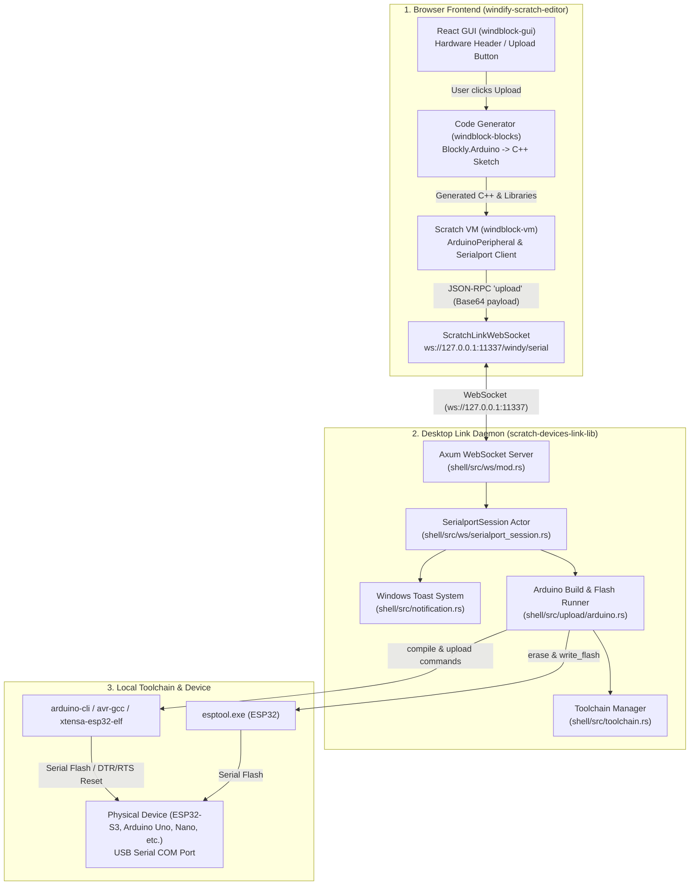
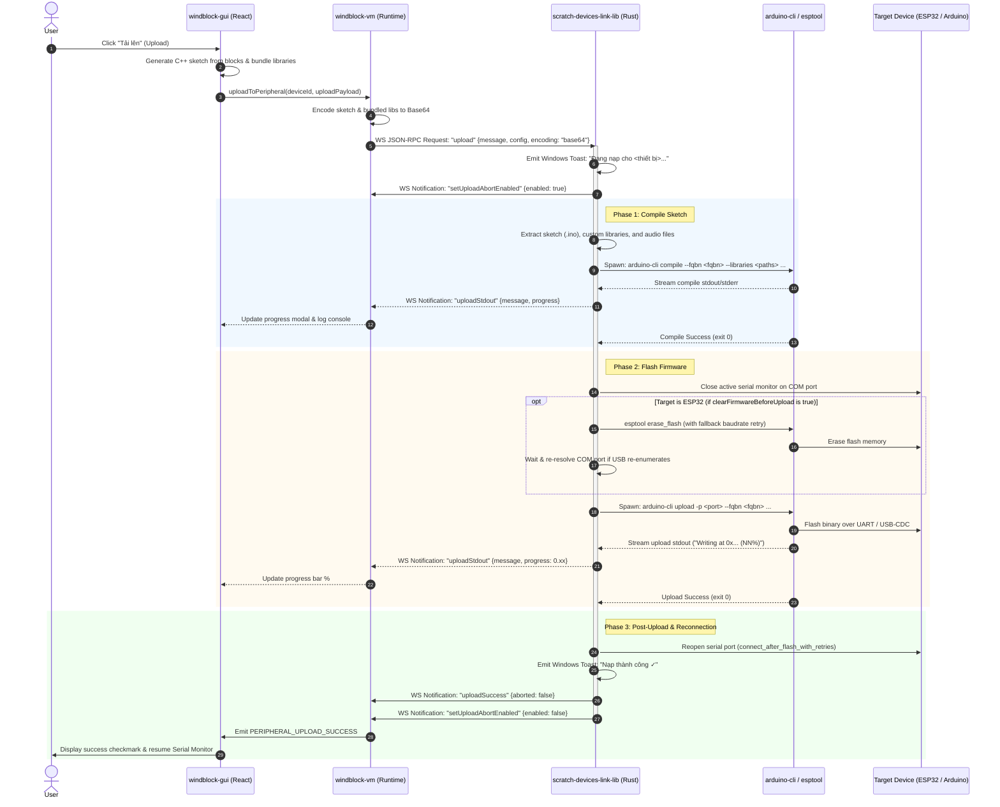

# Windify Code Upload & Flashing Workflow

> Comprehensive architectural and execution flow from the web editor ([**windify-scratch-editor**](file:///c:/Code/windify-scratch-editor)) through the local daemon ([**scratch-devices-link-lib**](file:///c:/Code/scratch-devices-link-lib)) to the physical microcontroller.

---

## 1. System Architecture Overview

The system consists of three main tiers interacting via WebSocket JSON-RPC 2.0 and local OS child processes:



---

## 2. End-to-End Sequence Diagram



---

## 3. Step-by-Step Execution Stages

### Stage 1: Code Generation & Payload Packaging (Web Editor)

1. **User Interaction**:
   - In [`packages/windblock-gui/src/containers/hardware-header.jsx`](file:///c:/Code/windify-scratch-editor/packages/windblock-gui/src/containers/hardware-header.jsx), the user clicks the **Upload** button.
   - The editor validates that a device is connected (`deviceId`) and code exists.
2. **Sketch & Library Resolution**:
   - Scratch blocks are converted into Arduino C++ code using `Blockly.Arduino.workspaceToCode()`.
   - Embedded audio files or extra assets are merged using `mergeWindifyAudioUploadHidden()`.
   - `buildUploadPayloadWithLibraries()` bundles required library source files (such as `Windify_Core` headers and C++ files) into a JSON payload structure:
     ```json
     {
       "v": 1,
       "main": "#include <Arduino.h>\nvoid setup() { ... }\nvoid loop() { ... }",
       "libraries": {
         "Windify_Core": {
           "src/Windify_Core.h": "...",
           "src/Windify_Core_Comm.h": "..."
         }
       }
     }
     ```
3. **VM Transmission**:
   - `hardware-header.jsx` calls `vm.uploadToPeripheral(deviceId, uploadPayload)`.
   - In [`packages/windblock-vm/src/devices/common/arduino-peripheral.js`](file:///c:/Code/windify-scratch-editor/packages/windblock-vm/src/devices/common/arduino-peripheral.js):
     - Clears any active Firmata listeners to prevent conflicts between upload mode and real-time mode.
     - Encodes the payload into a Base64 string:
       ```javascript
       const base64Str = Buffer.from(code).toString('base64');
       this._serialport.upload(base64Str, this.diveceOpt, 'base64');
       ```
4. **WebSocket JSON-RPC Dispatch**:
   - In [`packages/windblock-vm/src/io/serialport.js`](file:///c:/Code/windify-scratch-editor/packages/windblock-vm/src/io/serialport.js), packages the call into a standard JSON-RPC 2.0 request:
     ```json
     {
       "jsonrpc": "2.0",
       "id": 12,
       "method": "upload",
       "params": {
         "message": "<base64_encoded_payload>",
         "config": {
           "fqbn": "esp32:esp32:esp32s3:UploadSpeed=921600,CDCOnBoot=cdc,...",
           "baudRate": 115200
         },
         "encoding": "base64"
       }
     }
     ```
   - Sent via [`ScratchLinkWebSocket`](file:///c:/Code/windify-scratch-editor/packages/windblock-vm/src/util/scratch-link-websocket.js) to `ws://127.0.0.1:11337/windy/serial`.

---

### Stage 2: Ingestion & Session Handling (Link Daemon)

1. **WebSocket Route Matching**:
   - In [`shell/src/ws/mod.rs`](file:///c:/Code/scratch-devices-link-lib/shell/src/ws/mod.rs), Axum accepts the connection on route `/windy/serial` (or `/windy/serialport`, `/openblock/serialport`).
   - Upgrades socket and spawns [`SerialportSession`](file:///c:/Code/scratch-devices-link-lib/shell/src/ws/serialport_session.rs) actor task.
2. **Notification & UI Lock**:
   - In [`shell/src/ws/serialport_session.rs`](file:///c:/Code/scratch-devices-link-lib/shell/src/ws/serialport_session.rs):
     - Sets `self.tool_active = true`.
     - Sends `setUploadAbortEnabled` notification to allow the user to cancel if needed.
     - Dispatches native Windows Toast:
       ```rust
       notification::notify_upload_start(&path, "Đang biên dịch mã và nạp firmware...");
       ```

---

### Stage 3: Compilation Pipeline (`Arduino::build`)

Executed in [`shell/src/upload/arduino.rs`](file:///c:/Code/scratch-devices-link-lib/shell/src/upload/arduino.rs):

1. **Workspace Extraction**:
   - Creates project directory under `tools/Arduino/code/project/`.
   - Writes the sketch file (`project.ino`).
   - Writes bundled libraries into `tools/Arduino/code/project/libraries/<LibName>/...`.
   - Writes custom partition tables (`partitions.csv`) if audio features are detected.
2. **Command Construction**:
   - Derives FQBN (e.g. `esp32:esp32:esp32s3` or `arduino:avr:uno`).
   - Injects search paths for libraries:
     - `arduino/web-libraries/` (synced external libraries).
     - Bundled sketch libraries.
     - Built-in board package libraries.
   - Appends compiler defines and custom flags (e.g., `-DARDUINO_USB_CDC_ON_BOOT=1`).
3. **Execution & Real-Time Output**:
   - Spawns `arduino-cli compile`:
     ```powershell
     arduino-cli compile --fqbn <fqbn> --warnings=none --verbose --build-path <build_dir> --config-file <config> <sketch_dir>
     ```
   - Standard output and error streams are captured line-by-line and sent back to the browser via WebSocket:
     ```json
     {
       "jsonrpc": "2.0",
       "method": "uploadStdout",
       "params": {
         "message": "Sketch uses 245381 bytes (18%) of program storage space...\n"
       }
     }
     ```

---

### Stage 4: Flashing to Microcontroller (`Arduino::flash`)

1. **Port Release**:
   - Before flashing, `SerialportSession` pauses active serial reads and closes the serial port:
     ```rust
     self.disconnect(false).await;
     ```
   - This releases the OS handle so `arduino-cli` / `esptool` can obtain exclusive write access to the COM port.
2. **ESP32 Pre-Erase (Optional / Configurable)**:
   - If target is ESP32 and `clearFirmwareBeforeUpload` is enabled:
     - Runs `esptool.exe --chip <chip> --port <port> --baud 460800 erase_flash`.
     - If it fails, automatically retries at a lower rate (`115200 baud`) to overcome noisy USB cables.
     - Handles USB re-enumeration delay (`resolve_esp32_port_after_erase`) in case the MCU rebooted with a different port.
3. **Binary Flashing**:
   - Spawns `arduino-cli upload`:
     ```powershell
     arduino-cli upload --fqbn <fqbn> --verbose --verify -p <COM_PORT> --input-dir <build_dir>
     ```
   - As `esptool` or `avrdude` writes to flash, progress percentage lines like `Writing at 0x00010000... (45%)` are parsed.
   - Link server computes fraction (`0.45`) and sends progress update to both indicatif/GUI:
     ```json
     {
       "jsonrpc": "2.0",
       "method": "uploadStdout",
       "params": {
         "message": "Writing at 0x00010000... (45%)\n",
         "progress": 0.45
       }
     }
     ```

---

### Stage 5: Post-Flash Handshake & Reconnection

1. **Reconnection with Retries**:
   - Microcontroller automatically resets and executes the newly flashed program.
   - `SerialportSession` runs `connect_after_flash_with_retries()`:
     - Waits briefly for USB CDC / UART to settle.
     - Re-opens the COM port at the configured baud rate.
     - Resumes the incoming serial data stream (`resume_read_after_flash_reconnect`).
2. **Notification & Completion**:
   - Emits native Windows Toast:
     ```rust
     notification::notify_upload_success(&path);
     // Title: "Future Academy Link"
     // Text1: "Nạp thành công ✓"
     // Text2: "Đã nạp firmware thành công vào COMx"
     ```
   - Sends the final success JSON-RPC notification to the web editor:
     ```json
     {
       "jsonrpc": "2.0",
       "method": "uploadSuccess",
       "params": {
         "aborted": false
       }
     }
     ```
   - Sends `setUploadAbortEnabled: false`.
3. **Frontend Resolution**:
   - `windblock-gui` receives `PERIPHERAL_UPLOAD_SUCCESS`.
   - Closes the uploading modal and renders a success indicator.
   - Re-attaches console input/output to the newly running firmware on the board.

---

## 4. Error Handling & Abort Strategy

| Scenario | Handled By | Action & Behavior |
|---|---|---|
| **User cancels upload** | `abortUpload()` / `tool_abort` | Kills child process (`arduino-cli`/`esptool`), fires toast `"Đã hủy nạp"`, sends `uploadSuccess {aborted: true}`. |
| **Compilation error (syntax/missing lib)** | `Arduino::build` | Captures error log, triggers toast `"Nạp thất bại ✗"`, returns `uploadError` with red terminal ANSI text. |
| **COM port disappears / Device unplugged** | `SerialportSession` | Retries fallback ports matching vendor IDs (Espressif/WCH/Silicon Labs), sends `peripheralUnplug` if unreachable. |
| **ESP32 erase failure** | `clear_esp32_firmware_before_upload` | Automatically retries at 115200 baud; falls back gracefully to standard upload. |
| **Reopen port failure after flash** | `connect_after_flash_with_retries` | Upload is marked successful, but alerts user via yellow warning to reconnect serial manually. |

---

## 5. Key File Locations & References

- **Frontend (Windify Scratch Editor)**:
  - Header & Upload Trigger: [`packages/windblock-gui/src/containers/hardware-header.jsx`](file:///c:/Code/windify-scratch-editor/packages/windblock-gui/src/containers/hardware-header.jsx)
  - Peripheral Abstraction: [`packages/windblock-vm/src/devices/common/arduino-peripheral.js`](file:///c:/Code/windify-scratch-editor/packages/windblock-vm/src/devices/common/arduino-peripheral.js)
  - Serialport Client RPC: [`packages/windblock-vm/src/io/serialport.js`](file:///c:/Code/windify-scratch-editor/packages/windblock-vm/src/io/serialport.js)
  - WebSocket Transport: [`packages/windblock-vm/src/util/scratch-link-websocket.js`](file:///c:/Code/windify-scratch-editor/packages/windblock-vm/src/util/scratch-link-websocket.js)

- **Backend (Link Daemon)**:
  - WebSocket Routing: [`shell/src/ws/mod.rs`](file:///c:/Code/scratch-devices-link-lib/shell/src/ws/mod.rs)
  - Serialport Session State Machine: [`shell/src/ws/serialport_session.rs`](file:///c:/Code/scratch-devices-link-lib/shell/src/ws/serialport_session.rs)
  - Arduino Compiler & Flasher: [`shell/src/upload/arduino.rs`](file:///c:/Code/scratch-devices-link-lib/shell/src/upload/arduino.rs)
  - ESP32 Direct Flasher: [`shell/src/upload/esp32.rs`](file:///c:/Code/scratch-devices-link-lib/shell/src/upload/esp32.rs)
  - Toast Notifications: [`shell/src/notification.rs`](file:///c:/Code/scratch-devices-link-lib/shell/src/notification.rs)
